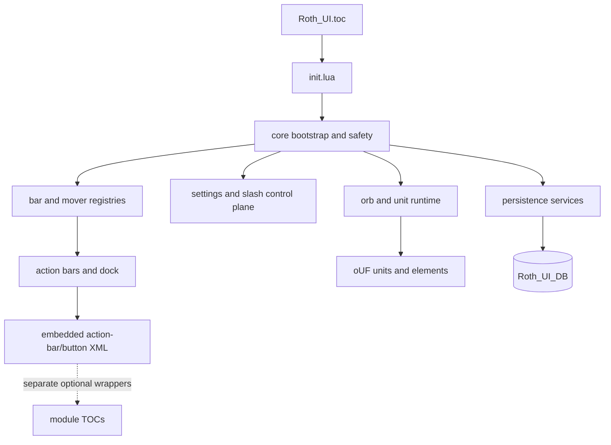

# Roth UI code graph

The graph is a repository-level ownership map, not a claim that every runtime call is synchronous. Deferred and post-combat paths are intentionally coordinated by core services.
